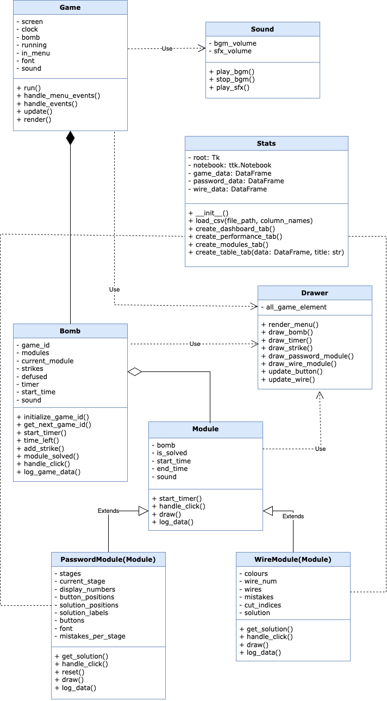

# I AM EOD

"I AM EOD" is a bomb-defusal game where players must solve various modules under a time limit. The game challenges players with logic puzzles, quick decision-making, and accuracy to defuse the bomb before time runs out or too many mistakes are made.

## Features

- **Modules**: Includes multiple modules such as:
  - **Password Module**: Solve a sequence of stages by pressing the correct buttons.
  - **Wire Module**: Cut the correct wire based on the given rules.
- **Timer**: A countdown timer adds urgency to the gameplay.
- **Strikes**: Players are allowed a limited number of mistakes before the bomb explodes.
- **Dynamic Logging**: Logs gameplay data, including mistakes, time taken, and completion status.
- **Statistics Viewer**: Analyze gameplay data with visualizations and performance metrics.

## Installation

1. Clone the repository:

   ```bash
   git clone https://github.com/natawipa/i-am-eod.git
   cd i-am-eod
   ```

2. Install the required dependencies:

   ```bash
   pip install -r requirements.txt
   ```

3. Ensure the following assets are available in the `element/` and `sound/` directories:
   - Fonts, images, and sound files as specified in `config.py`.

## How to Play

1. Run the game:

   ```bash
   python3 main.py
   ```

2. **Gameplay**:

   - Solve the active module by interacting with it:
     - **Password Module**: Click the correct buttons in sequence.
     - **Wire Module**: Cut the correct wire based on the rules.
   - Avoid making too many mistakes (strikes) or running out of time.

3. **Win Condition**:

   - Successfully solve all modules before the timer runs out.

4. **Lose Condition**:
   - Run out of time or exceed the maximum allowed strikes.

## Viewing Statistics

1. After completing a game, click the **"Static"** button in the main menu to view gameplay statistics.
2. The statistics viewer includes:
   - Summary statistics (e.g., success rate, average time).
   - Graphs for game completion rates, failure reasons, and module performance.
   - Detailed analysis of mistakes and time distribution.

## Bomb Defusal Instructions

For detailed instructions on how to solve each module, refer to the **Bomb Defusal Manual** included in this repository:  
**[Bomb Defusal Manual.pdf](./Bomb%20Defusal%20Manual.pdf)**

## UML Diagram

The following UML diagram illustrates the structure of the game, including its main classes and their relationships:


## Requirements

- Python 3.8 or higher
- Required libraries (installed via `requirements.txt`):
  - `pygame`
  - `matplotlib`
  - `seaborn`
  - `pandas`
  - `numpy`
- `tkinter` (usually included with Python, but ensure it is installed on your system)

## Screenshots

### Gameplay

Screenshots of the gameplay can be found in the `screenshots/gameplay` folder.

### Visualization

Screenshots of the statistics viewer and visualizations can be found in the `screenshots/visualization` folder.
